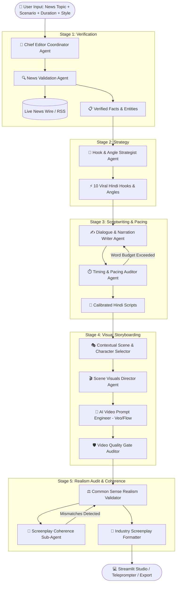

# 🎬 AI Script Maker (AI पटकथा निर्माता)
### Autonomous Multi-Agent Screenplay Studio for 9:16 Vertical Hindi Short Content (Instagram Reels, YouTube Shorts, TikTok)

[](https://www.python.org/downloads/)
[](https://streamlit.io/)
[]()
[]()
[]()
[]()

---

## 📖 Overview

**AI Script Maker** is an enterprise-grade autonomous multi-agent studio engineered specifically for short-form video creators, digital newsrooms, and social media agencies. It transforms raw news headlines, wire feeds, and custom creative scenarios into broadcast-ready, production-grade **9:16 vertical screenplays** strictly in fluent **Hindi dialogues (in Devanagari script)** with professional **English scene directions**.

Equipped with a collaborative team of specialized AI sub-agents, autonomous self-healing feedback loops, a dynamic domain imagination engine, and an industry-standard vertical screenplay formatter, AI Script Maker guarantees authentic casting, coherent physical kinematics, and calibrated speech durations.

---

## 🌟 Key Capabilities & Highlights

- 🎭 **Canonical Industry Screenplay Format:** Outputs standard vertical scripts featuring `SCENE DETAIL`, `CHARACTERS & CLOTHING`, continuous camera focus cues, pure physical body action lines, optional text overlays, and sound design cues.
- 🤝 **Relational Cast Grounding:** Intelligently casts authentic real-world relationships (*College Friends, Husband & Wife, Father & Son, Corporate Colleagues, Kirana Trader & Customer, Doctor & Attendant, Lawyer & Litigant, Activist & Builder*).
- 🏢 **Contextual Venue Scout (Not Everything is Chai Tapri!):** Institutional topics are placed in authentic venues (*District Collectorates, High Court Corridors, Tech Park Cafeteria Pods, ICU Duty Rooms, Wholesale APMC Mandis, Bullion Vaults, Metro Turnstiles*).
- 🔮 **Dynamic Imagination Engine:** Synthesizes custom domains, specialized personas, and domain wardrobes for unlisted or emerging topics (*ISRO Space Missions, Aviation, Railways, Bullion, Renewable Energy, Real Estate, Defence*).
- 🎯 **Screenplay Coherence Sub-Agent:** Physically locks actor kinematics and camera focus to objects mentioned in dialogue (*sipping cutting chai, unfolding morning newspapers, waving billing receipts, thrusting smartphone screens, counting currency, slamming coaching textbooks, pressing official ink stamps*).
- ⚖️ **Common Sense Realism Validator:** Audits screenplay realism for setting-character mismatches, marital vocative errors (*e.g. calling male friends "सुनती हो"*), and occupational prop ergonomics (*tea vendor handling phone with wiping cloth and strainer*), triggering automatic self-healing retries.
- ⚡ **Dual-Engine AI Inference Bridge:** High-speed private on-device inference via **Apple Foundation Models (`fm`)**, with an explicit hybrid mode for optional **Antigravity (`agy`)** fallback.
- ⏱️ **Pacing & Word Count Calibration:** Mathematical word-budget enforcement across 10s, 15s, 20s, 30s, 45s, and 60s timelines at natural Indian speech delivery rates (~2.3 words/sec).
- 🪓 **Strict Ban on Social Media Meta:** dialogue strictly contains in-universe character conversation, purging all meta calls (*"comment below", "like and share", "subscribe"*).

---

## 🏗️ Multi-Agent Architecture



---

## 🤖 The Specialist Agent Roster

| Agent Icon & Name | Role & Responsibility | Core Functions |
| :--- | :--- | :--- |
| 👑 **Chief Editor Coordinator** | Master Orchestrator | Decomposes master instructions into 7 specialized sub-directives; manages stage pipelines and retries. |
| 🔍 **News Validation Agent** | Live Wire Fact-Checker | Queries Google News RSS and wire feeds; extracts verified facts, locations, and key entities; computes confidence scores. |
| 🎯 **Hook & Angle Strategist** | Viral Angle Formulator | Crafts scroll-stopping Devanagari hooks tailored to target duration across 10 distinct editorial angles. |
| ✍️ **Dialogue Writer Agent** | Spoken Dialogue Author | Writes in-universe, authentic spoken Hindi dialogue without meta CTAs; casts relational pairs and domain specialists. |
| ⏱️ **Timing Auditor Agent** | Duration & Pacing Auditor | Calibrates spoken word counts to target duration budgets (10s: ~15-18w, 15s: ~28-34w, 30s: ~60-72w). |
| 🎭 **Contextual Scene Selector** | Production Location Scout | Selects domain-authentic physical venues from 150+ curated setups; activates Dynamic Imagination Engine when needed. |
| 🎬 **Scene Visuals Director** | Camera & B-Roll Director | Directs physical actor action lines, props, continuous takes, and environmental audio cues. |
| 🎯 **Screenplay Coherence Auditor** | Dialogue-Action Synchronizer | Analyzes spoken words for concrete objects (chai, newspaper, phone, bills) and physically locks actor actions to them. |
| ⚖️ **Common Sense Realism Validator** | Physical Realism Gatekeeper | Detects setting clashes, vocative target errors, and trade ergonomics, feeding back actionable self-healing corrections. |
| 🎥 **AI Video Prompt Engineer** | Generative Video Prompter | Synthesizes clean 9:16 vertical 4K camera tokens tailored for Google Flow and Veo without internal jargon. |
| 🛡️ **Video Quality Gate Auditor** | Visual Continuity Gate | Audits prompt policy compliance, temporal consistency, and prompt feasibility. |

---

## 📜 Canonical Screenplay Specification

All generated screenplays follow the industry-standard vertical reel format:

```text
[Format Requirement: 9:16 Vertical Reel | All scene descriptions in English, Dialogues strictly in Hindi]

SCENE DETAIL:
⚬   A bustling local Indian street chai tapri. Very fast-paced, high-energy vibe to fit the 10-second limit.

CHARACTERS & CLOTHING:
⚬   ANANYA: Casual college-going attire (e.g., jeans and a simple kurti).
⚬   VIKRAM: Everyday street casual wear (e.g., t-shirt and jeans).

[Time: 0:00 - 0:03]
Camera Focus & Action: Fast whip-pan to Ananya slamming a book on the tapri counter.
Text Overlay (Optional): No Jobs?
Audio/SFX: Fast whoosh + heavy book slam.
ANANYA: "डिग्री ले ली, नौकरी कहाँ है?"

[Time: 0:03 - 0:06]
Camera Focus & Action: Quick pan to Vikram shoving his phone screen into the frame.
Audio/SFX: Record scratch effect.
VIKRAM: "सिस्टम को स्टूडेंट नहीं, अंधभक्त चाहिए!"

[Time: 0:06 - 0:10]
Camera Focus & Action: Fast pull back to frame both. Ananya mockingly tosses her book aside.
Text Overlay (Optional): Need new coaching!
Audio/SFX: Comedic drum punchline.
ANANYA: "तो भाई, मेरा भी अंधभक्ति कोचिंग में एडमिशन करा दे!"
```

---

## 📚 150+ Curated Setups Matrix (Minimum 5–6 per Category)

The system maintains a comprehensive catalog in [`agents/scene_catalog.py`](agents/scene_catalog.py) ensuring that every Scene Style, Creative Angle, and Script Topic Domain has **at least 5–6 distinct setups**:

### 1. Scene Styles
- **Dialogue (2 Characters):** Campus Tapri Friends, Kitchen Budget (Husband & Wife), Study Veranda (Father & Son), IT Park Cafeteria (Colleagues), Kirana Store (Trader & Customer), OPD Consultation (Doctor & Attendant).
- **Narration (Solo):** Urban Public Crossroad, Tech Park Skybridge, Household Ledger Table, Ministry Bhavan Gate, Coaching Library Cubicle, Village Panchayat Chaupal.
- **Debate:** Macro Economist vs Ground Reality Citizen, Traditional Elder vs Gen-Z, Government Spokesperson vs RTI Activist, Startup Founder vs Gig Worker, Infrastructure Builder vs Ecologist, Prosecutor vs Defence Counsel.
- **Interview:** Investigative Journalist & Whistleblower, Tech Podcaster & AI Scientist, Field Correspondent & Flood Victim, Financial Anchor & Bullion Merchant, Sports Reporter & Sprinter, Consumer Host & Regulatory Chief.
- **Street Reaction (Vox-Pop):** Metro Turnstile Concourse, City Bus Shelter, Wholesale Sabzi Mandi, Coaching Center Lane, Holy River Ghat, Multiplex Lobby.
- **Satirical Skit:** Vain Politician & Sharp Chaiwala, Red-Tape Babu & Baffled Citizen, FinTech Salesman & Skeptical Dadi, Corporate HR & Sleepy Coder, Coaching Marketer & Frugal Father, Traffic Cop & Excuse Artist.
- **Lament / Emotional:** Bereaved Kin & Consoling Elder, Laid-Off Tech Worker & Spouse, Debt-Hit Farmer & Peer, Aging Handloom Weaver & Son, Care Home Resident & Volunteer, Exhausted ICU Night-Shift Doctors.
- **Argument:** Middle-Class Kitchen Budget Dispute, Father-Son Career Ambition Clash, Stilt Parking Dispute, Annual Performance Appraisal Clash, Landowner vs Building Contractor, Passenger vs Bus Conductor.

### 2. Creative Angles
- *Contrast & Comparison*, *The Untold Truth / Hidden Angle*, *Common Citizen Impact*, *Satire & Irony*, *Future Forecast & What Next*, *Follow the Money / Economic Audit*, *Emotional & Human Story*, *Actionable Advice / Life Hack*.

### 3. Script Topic Domains
- *Government Administration & SIR*, *Healthcare & Medicine*, *Legal & Courts*, *Technology & Corporate IT*, *Economy, Markets & Bullion*, *Education, Coaching & Careers*, *Infrastructure, Aviation & Railways*, *Environment, Pollution & Climate*, *Police & Public Safety*, *Domestic Household*.

---

## ⚡ Dual-Engine AI Inference (Local LLM Supported!)

> **🏠 This project can run entirely on a local LLM — no cloud API keys required.**

AI Script Maker operates on an autonomous dual-engine architecture that **prioritizes local, on-device inference** for maximum privacy and speed:

### Primary: Local LLM (On-Device, 100% Private)

1. **🍏 Apple Foundation Models (`fm`) — Built-in:**
   - Direct on-device macOS inference via `/usr/bin/fm` (Apple Silicon M1/M2/M3/M4).
   - **Zero internet required.** All prompts stay on your machine — 100% private.
   - Ultra-low latency (~2-5s per generation), no API keys, no rate limits.
   - Automatically detected on macOS 15+ (Sequoia) with Apple Silicon.

2. **🦙 Generic Local LLM support (Work in Progress):**
   - Ollama, llama.cpp, LM Studio, and other local servers are not yet a supported selectable engine in the UI.
   - The integration point is [`core/dual_engine.py`](core/dual_engine.py); provider-specific request handling, context management, health checks, streaming, and failure reporting still need to be completed before this is production-ready.
   - Do not assume that selecting **On-device** uses one of these generic local servers: it strictly uses Apple Foundation Models through `/usr/bin/fm`.

### Fallback: Cloud Reasoning

3. **⚡ Antigravity (`agy`) — Cloud Fallback:**
   - Cloud reasoning and deep factual synthesis via `agy`.
   - Activates only when the user selects Local First Then Antigravity mode and local inference is unavailable, restricted, or encounters an error. Strict On-device and Antigravity selections never switch models.
   - Used for complex multi-agent decompositions when local models lack capacity.

4. **🧠 Grok — Cloud Model:**
   - Uses the installed Grok CLI with a fresh one-shot request for every generation.
   - The engine selector provides **Grok Low**, **Grok Medium**, and **Grok High** reasoning modes.
   - Login/model access is checked before generation; rate limits, quota, authentication, and service errors are shown as real failures.
   - Each Grok mode is strict: it does not silently fall back to Apple FM or Antigravity.

### 🛡️ Autonomous Zero-Crash Failover
   - If the selected model is unavailable or fails, generation stops quickly and the UI reports the failure. No synthetic or stale script is shown as a successful result.
   - The system tracks local model availability and skips it on subsequent calls if it's consistently failing, preventing repeated timeouts.

---

## 💻 Installation & Setup

### Prerequisites
- macOS (Apple Silicon M1/M2/M3/M4 recommended) or Linux.
- Python 3.11 or higher.
- `git` installed.

### 1. Clone the Repository
```bash
git clone https://github.com/abhi266raj/ai-script-maker.git
cd ai-script-maker
```

### 2. Create and Activate Virtual Environment
```bash
python3 -m venv .venv
source .venv/bin/activate
```

### 3. Install Dependencies
```bash
pip install -r requirements.txt
```

---

## 🚀 Running the Studio

### Launch the Streamlit Web Application
```bash
./run.sh
```
*Or directly via Streamlit:*
```bash
source .venv/bin/activate
streamlit run app.py
```
Open **`http://localhost:8501`** in your web browser.

### Key Web Studio Features
- **Sidebar Configuration:** Select target duration (10s to 60s), scene style, creative angle, tone, character count, and engine mode.
- **Custom Reference Scenario:** Input sample stories or specific character pairs with top precedence.
- **Interactive Multi-Agent Progress Stream:** Watch each agent validate facts, formulate angles, write dialogue, and verify realism in real time.
- **Script Card & Screenplay Tabs:** Toggle between canonical Industry Screenplay, Teleprompter text, and AI Video Director prompts.
- **Export Capabilities:** One-click copy or download formatted screenplays in standard Markdown.

---

## 🧪 Running the Unit Tests

The test suite validates personas, tailored instructions, screenplays, compliance gates, dynamic imagination, screenplay coherence, and the 150+ setup matrix:

```bash
source .venv/bin/activate
python tests/test_character_and_creative_scenes.py
```

### Verified Test Cases (17/17 Passing 100%):
1. `test_character_personas_mapping`
2. `test_creative_guidelines`
3. `test_tailored_instruction_matrix`
4. `test_sadness_tone_angle_and_lament_style`
5. `test_configuration_compliance_gate`
6. `test_dead_configs_purged_and_update_instruction`
7. `test_no_commenting_in_dialogue_or_script`
8. `test_preference_persistence_and_categories`
9. `test_professional_screenplay_scene_description_and_clean_beats`
10. `test_argument_style_and_relational_characters`
11. `test_sample_story_character_and_relationship_precedence`
12. `test_script_continuity_and_setting_analyzer`
13. `test_common_sense_validator_step_and_retry_feedback`
14. `test_contextual_selector_and_sir_government_domain`
15. `test_dynamic_imagination_engine_for_missing_pairs_and_settings`
16. `test_screenplay_coherence_sub_agent_and_dialogue_action_sync`
17. `test_scene_character_location_relationship_matrix`

---

## 📂 Project Structure

```text
ai-script-maker/
├── app.py                         # Streamlit Web Studio UI
├── workflow.py                    # Multi-agent streaming orchestrator
├── run.sh                         # One-click startup script
├── REQUIREMENTS.md                # Comprehensive technical specification
├── project_config.json            # Studio settings & category preferences
├── studio_config.json             # Active runtime session state
├── agents/                        # Autonomous AI sub-agents
│   ├── base.py                    # BaseAgent interface
│   ├── chief_editor.py            # Chief Editor Coordinator & Compliance Auditor
│   ├── news_validator.py          # News wire verification & entity extraction
│   ├── hook_strategist.py         # Viral angle & Devanagari hook formulator
│   ├── dialogue_writer.py         # Hindi dialogue writer & word-count trimmer
│   ├── timing_auditor.py          # Duration & pacing math auditor
│   ├── contextual_selector.py     # Domain venue scout & dynamic imagination engine
│   ├── scene_catalog.py           # 150+ curated setups (styles, angles, domains)
│   ├── scene_director.py          # Visual scene & B-roll kinematic director
│   ├── screenplay_coherence.py    # Spoken dialogue-action prop synchronizer
│   ├── video_prompt_engineer.py   # 9:16 vertical AI prompt generator (Veo/Flow)
│   └── video_quality_gate.py      # Prompt continuity & feasibility auditor
├── core/                          # Core engine & infrastructure
│   ├── dual_engine.py             # Dual-engine bridge (Apple FM + Antigravity)
│   ├── script_analyzer.py         # Common sense realism validator & target healer
│   ├── screenplay_formatter.py    # Industry 9:16 screenplay formatter
│   ├── prompt_matrix.py           # Tailored instruction synthesizer
│   ├── metrics.py                 # Duration budgets & speech delivery rates
│   ├── config.py                  # Configuration loader & persistent storage
│   └── models.py                  # Pydantic data models & script schemas
├── tools/                         # External tools & integrations
│   └── news_fetcher.py            # Google News RSS live fetcher
└── tests/                         # Test suites
    └── test_character_and_creative_scenes.py  # 17 unit tests
```

---

## 📜 License

This project is licensed under the Apache 2.0 License - see the LICENSE file for details.
