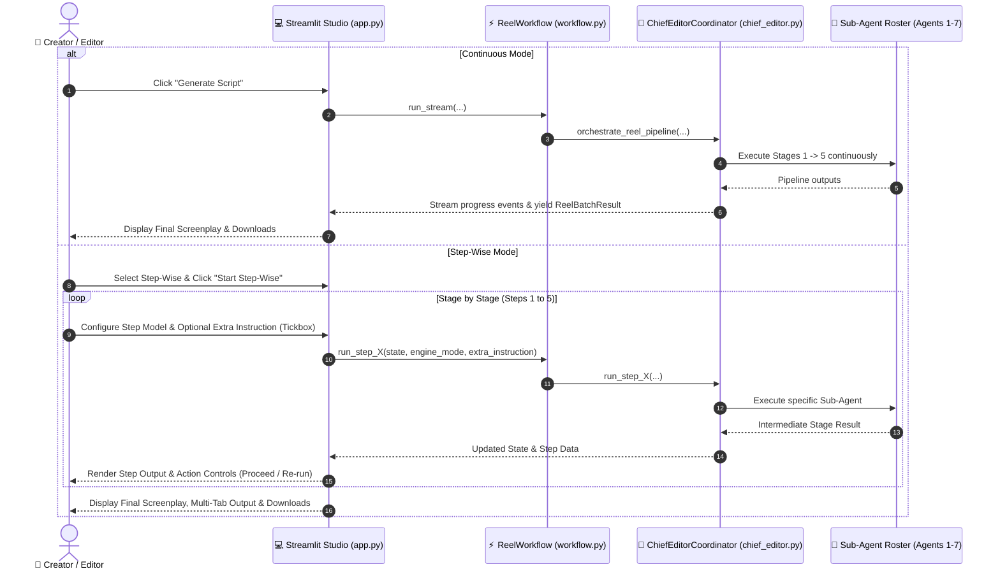

# System Requirements Specification (SRS)

## 📌 Feature: Continuous vs Step-Wise Script Generation with Per-Step Model Selection & Dynamic Instruction Refinement

**Status:** Implemented  
**Target:** Hindi Reel Studio (AI Script Maker)  
**Architecture:** Multi-Agent Editorial Pipeline (Chief Editor, News Validator, Hook Strategist, Dialogue Writer, Timing Auditor, Scene Director, Video Prompt Engineer, Video Quality Gate)

---

### 1. Executive Summary & Objective

In production reel creation, users need both:
1. **Continuous Mode:** Rapid, one-click end-to-end execution of the full multi-agent pipeline from news validation to finalized screenplay.
2. **Step-Wise Mode:** An interactive, checkpointed workflow where creators review intermediate outputs at each stage, inject custom instructions or course-corrections via an interactive tickbox, and optionally switch the AI model/engine on a per-step basis before advancing to the final screenplay.

This architectural enhancement makes the generation pipeline modular, scalable, observable, and adaptable to complex creative directions.

---

### 2. User Stories & Functional Requirements

#### 2.1 Mode Selection (Continuous vs Step-Wise)
- **FR-1.1:** The user must be able to switch between **⚡ Continuous (Automated)** and **🪜 Step-Wise (Interactive)** generation modes from the Studio interface.
- **FR-1.2:** In **Continuous Mode**, the pipeline functions uninterrupted, streaming telemetry across all 5 stages and presenting the final screenplay upon completion.
- **FR-1.3:** In **Step-Wise Mode**, the pipeline pauses at the completion of each stage, rendering the stage's structured outputs and awaiting user review/instruction before proceeding.

#### 2.2 Per-Step Model / Engine Override
- **FR-2.1:** In Step-Wise mode, every individual stage provides a dedicated **Model / Engine selector** (`Local First Then Antigravity`, `Antigravity`, `Codex`, `Grok Low`, `Grok Medium`, `Grok High`, `On-device`).
- **FR-2.2:** The user can select different engines for different stages (e.g., *Codex* for Fact Checking, *Grok High* for Hook Writing, *Antigravity* for Screenplay Dialogue, *Local FM* for Scene Storyboards).
- **FR-2.3:** Engine selection for a step takes effect immediately for both initial execution and subsequent re-runs of that step.

#### 2.3 Dynamic Instruction Refinement via Tickbox
- **FR-3.1:** At each step, an optional tickbox/checkbox allows the creator to provide **Extra Instructions**:
  - `☑ Provide extra instruction for this step (re-run / refine)`
  - `☑ Provide extra instruction for next step`
- **FR-3.2:** When checked, an instruction text area expands, accepting natural-language guidance (e.g., *"Make tone more sarcastic", "Place in high court corridor", "Focus on consumer inflation"*).
- **FR-3.3:** The Chief Editor seamlessly merges the extra instruction into the specialized sub-instructions dispatched to the underlying sub-agent.
- **FR-3.4:** The user can re-run the current step with updated instructions and/or a new model, or proceed forward to the next step with queued guidance.
- **FR-3.5 (Same-Stage Output Feedback & Correction Loop):** When a stage is re-run with user feedback/corrections, the orchestrator MUST capture the previous output/draft of that exact stage and pass it back into the agent alongside the user's critique under a high-priority `REVISION & CORRECTION MODE` block. The agent treats the previous output as the baseline draft and rewrites/improves it to directly resolve the user's critique.

#### 2.4 Intermediate Stage Outputs & Telemetry
- **FR-4.1 Stage 1 (News Validation & Dossier Extraction):**
  - Displays: Verified facts, confidence score, physical props extracted, key locations, core conflict/irony, and generated sub-instructions.
  - Same-stage revision: Captures previous facts and summary to refine directly upon retry.
- **FR-4.2 Stage 2 (Character Finalisation & Viral Hooks):**
  - Role: Grounded in Stage 1 news dossier and scenario, finalizes specific actors/characters (names, professions/jobs, attire, emotional stance, and relational dynamic) and sequential story beat steps (action and speech objective).
  - Displays: Finalized characters (occupations, wardrobes, emotional stances), story beat actions, formulated Devanagari hooks (0-3s), and closing CTAs.
  - Upstream Hand-off: Passes finalized characters and story steps directly to Stage 3 Dialogue Writer to prevent generic persona drift.
- **FR-4.3 Stage 3 (Spoken Dialogue Writing, Interconnectedness & Timing Audit):**
  - Uses exact Stage 2 finalized characters and story steps to craft spoken Hindi dialogue lines.
  - Displays: Character dialogue lines, speech word count, recommended word budget, strict max limit, and timing audit calibration status.
  - **Dialogue Interconnectedness Standard:** Characters must NOT deliver isolated monologues. Every line (Beat 2 onwards) must directly answer, counter, or rebut the previous speaker using reactive connectors, echo-and-pivot keyword callbacks, and natural Hindi conversational ping-pong.
  - Same-stage revision: Captures previous dialogue draft to resolve critiques directly upon retry.
- **FR-4.4 Stage 4 (Scene Storyboards & AI Video Prompts):**
  - Displays: 9:16 vertical scene beats, physical actor kinematics, on-screen Devanagari text overlays, audio/SFX cues, and generative video prompts (Google Flow / Veo).
  - Same-stage revision: Captures previous storyboard scenes to refine camera framing and actions upon retry.
- **FR-4.5 Stage 5 (Chief Editor Review & Final Packaging):**
  - Displays: Full configuration compliance audit, common-sense validation, and the final production screenplay package.

#### 2.5 Final Production Deliverables
- **FR-5.1:** Upon completing Step 5, the studio provides the identical full production outputs as Continuous mode:
  - 🎬 Industry-Standard Vertical Screenplay (Markdown)
  - 🎙️ Devanagari Voiceover / Teleprompter Script
  - 📝 Plain Script (Clean Text)
  - 🎥 AI Video Generation Prompts (Google Flow / Veo 9:16)
#### 2.6 Default Testing Isolation Policy
- **FR-6.1 (Local Model Testing Standard):** Default testing must execute strictly on the local on-device model (`fm_only` / local inference bridge). All standard test runs and CI checks default exclusively to this local model.
- **FR-6.2 (Isolation from Remote Sources):** Default automated tests must NOT query or execute against external remote sources or live cloud endpoints (e.g., unmocked Grok, Codex, remote Antigravity services, or live external RSS feeds). All default tests verifying pipeline flow and agent handoffs must either run against the local model or employ deterministic local mocks to avoid network flakiness, rate limiting, and credential dependencies.
- **FR-6.3 (Conditional Testing for Other Models - Bug Finding & Diagnostics Only):** Tests for external/alternative models (such as Grok, Codex, or AGY cloud APIs) must **ONLY** be run when specifically needed—such as when investigating a bug report, verifying a regression fix in that specific engine adapter, or during manual diagnostic triage. They must NOT be part of default test discovery or routine validation runs.

---

### 3. Technical Architecture & Data Flow

---

### 4. Non-Functional & Scalability Requirements

- **NFR-1 (State Isolation & Scalability):** Intermediate pipeline state is encapsulated in a pure Python dictionary structure, enabling pause, resume, re-execution, and potential multi-user session serialization.
- **NFR-2 (Backward Compatibility):** Existing tests, CLI runners, and continuous mode behavior remain 100% backward compatible without breaking changes.
- **NFR-3 (Failure Resilience):** If any individual step fails or encounters model rate limits, only that step fails gracefully, allowing the user to select an alternative model (e.g. switch to Antigravity or Local FM) and re-try that exact step without losing progress.
