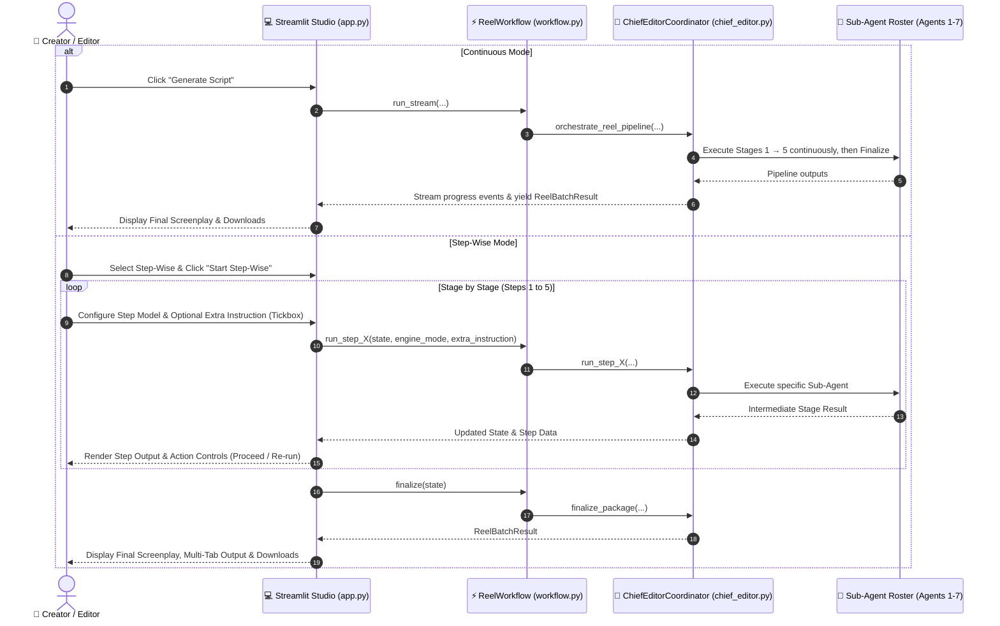

# System Requirements Specification (SRS)

## 📌 Feature: Continuous vs Step-Wise Script Generation with Per-Step Model Selection & Dynamic Instruction Refinement

**Status:** Implemented — refinements in progress (step-wise coordination hardening)  
**Target:** Hindi Reel Studio (AI Script Maker)  
**Architecture:** Multi-Agent Editorial Pipeline (Chief Editor, News Validator, Hook Strategist, Dialogue Writer, Timing Auditor, Scene Director, Video Prompt Engineer)

---

## 🔴 MOST IMPORTANT: Fail Loudly, Never Silently

This is the #1 architectural principle. No stage may EVER silently substitute default, empty, or synthetic fallback output when:
- The AI model fails or raises an exception
- The model returns unparseable content
- The model produces 0 usable units (0 beats, 0 characters, 0 scenes)
- Validation fails after automatic correction

Every such failure MUST raise an explicit `ModelGenerationError` with:
- The stage number and name
- The error type and message
- A snippet of the raw model output (for debugging)
- The parameters that were used

The UI MUST display the error prominently while keeping ALL previous completed stages' full output visible and copyable. The user gets: Retry, Back-to-previous-stage, and Exit.

Code-level validators (NOT just prompt rules) MUST enforce:
- No generic clothing ("everyday wear", "casual clothes", etc.)
- No SFX/tone mismatch (comedic SFX in serious tones)
- No 0-beat dialogue output
- No invented news facts
- No formal/shuddh Hindi in dialogue
- Scene-dialogue-news coherence (visuals must match the story)

Prompt rules are suggestions. Code validators are enforcement.

**Stage 1 Specific:** Stage 1 (Facts & Verification) must provide concise reel-usable facts — who (1-2 key names), what happened (one clear line), key number/figure (if any). Not a full news report, not just a headline. If the model returns no usable facts, Stage 1 MUST fail loudly with ModelGenerationError — never substitute "Story confirmed: {headline}" as verified facts.

---

### 1. Executive Summary & Objective

In production reel creation, users need both:
1. **Continuous Mode:** Rapid, one-click end-to-end execution of the full multi-agent pipeline from news validation to finalized screenplay.
2. **Step-Wise Mode:** An interactive, checkpointed workflow where creators review intermediate outputs at each stage, inject custom instructions or course-corrections via an interactive tickbox, and optionally switch the AI model/engine on a per-step basis before advancing to the final screenplay.

This architectural enhancement makes the generation pipeline modular, scalable, observable, and adaptable to complex creative directions.

---

### 2. User Stories & Functional Requirements

#### 2.1 Mode Selection (Continuous vs Step-Wise)
- **FR-1.1:** The user must be able to switch between **⚡ Continuous (Automated)** and **🪜 Step-Wise (Interactive)** generation modes from the Studio interface.
- **FR-1.2:** In **Continuous Mode**, the pipeline functions uninterrupted, streaming telemetry across all 5 stages, then runs Finalize automatically and presents the final screenplay upon completion.
- **FR-1.3:** In **Step-Wise Mode**, the pipeline pauses at the completion of each stage, rendering the stage's structured outputs and awaiting user review/instruction before proceeding.

#### 2.2 Per-Step Model / Engine Override
- **FR-2.1:** In Step-Wise mode, every individual stage provides a dedicated **Model / Engine selector** (`Local First Then Antigravity`, `Antigravity`, `Codex`, `Grok Low`, `Grok Medium`, `Grok High`, `On-device`).
- **FR-2.2:** The user can select different engines for different stages (e.g., *Codex* for Fact Checking, *Grok High* for Hook Writing, *Antigravity* for Screenplay Dialogue, *Local FM* for Scene Storyboards).
- **FR-2.3:** Engine selection for a step takes effect immediately for both initial execution and subsequent re-runs of that step.

#### 2.3 Dynamic Instruction Refinement via Tickbox
- **FR-3.1:** At each step, an optional tickbox/checkbox allows the creator to provide **Extra Instructions**:
  - `☑ Provide extra instruction for this step (re-run / refine)`
  - `☑ Provide extra instruction for next step`
- **FR-3.2:** When checked, an instruction text area expands, accepting natural-language guidance (e.g., *"Make tone more sarcastic", "Place in high court corridor", "Focus on consumer inflation"*).
- **FR-3.3:** The Chief Editor seamlessly merges the extra instruction into the specialized sub-instructions dispatched to the underlying sub-agent.
- **FR-3.4:** The user can re-run the current step with updated instructions and/or a new model, or proceed forward to the next step with queued guidance.
- **FR-3.5 (Same-Stage Output Feedback & Correction Loop):** When a stage is re-run with user feedback/corrections, the orchestrator MUST capture the previous output/draft of that exact stage and pass it back into the agent alongside the user's critique under a high-priority `REVISION & CORRECTION MODE` block. The agent treats the previous output as the baseline draft and **REFINES** it — keeping every beat, line, joke, and character moment that already works, and changing ONLY what the critique targets. It MUST NOT discard the draft to generate a brand-new unrelated output, and it MUST NOT drop the draft's established creativity, angle, or tone unless the feedback explicitly asks for it.
- **FR-3.6 (Feedback Replacement, Not Stacking):** Re-running a stage with new feedback REPLACES any stale feedback block on that stage's sub-instruction instead of appending alongside it, so the model always follows the LATEST feedback and never receives contradictory stacked critiques.
- **FR-3.7 (Step-by-Step Instruction Building):** Stage 1 builds ONLY its own (news validator) sub-instruction. Each subsequent stage builds its own agents' sub-instructions at the moment it runs, using the freshest upstream outputs (e.g. Stage 3/4 instructions reference the finalized Stage-2 character names, not generic placeholders). No stage pre-generates later stages' instructions in one shot.
- **FR-3.8 (Fail Loudly, Never Fall Silently):** If model generation fails inside a stage (engine exception, unparseable output, or validation still failing after the automatic corrective retry), the stage MUST raise an explicit error with details — it MUST NOT silently substitute synthetic fallback content and present it as success. Deterministic silent fallbacks are BANNED in Stage 3.
- **FR-3.9 Stage 3 Validation (5 numbered checks; ONE AI validator call; Tone enforced; News advisory):** Stage 3 runs exactly 5 numbered checks in one fail-fast sequence — 3.2.1 Structure, 3.2.2 Tone + news, 3.2.3 Language, 3.2.4 Clothing, 3.2.5 SFX — with no separate final gate. There is exactly ONE AI validator call per script per attempt: `ai_judge_script_quality` judges BOTH tone compliance (enforced) and news coverage (advisory) in a single model call and returns a split verdict. The other four checks are code validators (free, deterministic: structure rules, formal-Hindi scan, clothing specificity, SFX/tone match). Every check is labeled "AI validator" or "code validator" in the UI so the user sees which checks cost a model call. When the tone verdict fails, the specific issue is fed back to the AI for one corrective regeneration on the exact failed draft; if the retry budget is exhausted the stage fails loudly with evidence. News coverage is ADVISORY-ONLY: instead of policing the news with a blocking gate, the dialogue prompt instructs the model to INSERT THE NEWS CREATIVELY (weave verified facts into character voices, banter, and jokes so the viewer absorbs what happened through the story, never a lecture). The news verdict is surfaced in the 3.2.2 check output, but it NEVER fails the stage, triggers a retry, or appears in retry feedback.
- **FR-3.10 (Failure UX — Output Till Previous Stage + Error Detail):** When a stage fails, the UI MUST keep every completed previous stage's full output visible (nothing is wiped), show the error detail (error type, failed step, message, and any partial model output), and offer Retry (same step), Back to previous step, and Exit controls.

#### 2.4 Intermediate Stage Outputs & Telemetry
- **FR-4.1 Stage 1 (News Validation & Dossier Extraction):**
  - Displays: Verified facts, confidence score, physical props extracted, key locations, core conflict/irony, and this stage's own sub-instruction. (Stage 1 does NOT pre-generate later stages' instructions — see FR-3.7.)
  - Same-stage revision: Captures previous facts and summary to refine directly upon retry.
  - **24h verification cache:** A successful Stage 1 verification is cached for 24 hours (keyed by normalized news input, stored in `.verification_cache.json`, gitignored). The same news within 24h reuses the cached `NewsVerificationReport` with no validator API call; the UI shows "cached Xh ago". Cache is bypassed when the user requests a correction (extra instruction / previous verification). Failures are never cached.
  - **Stage 1 output format:** Status (Verified / Failed), Confidence score, Summary (one line), Verified Facts (3-5 reel-usable bullets — WHO, WHAT, KEY NUMBER), Sources. The UI MUST render all five in both step-wise and continuous modes.
  - **Cache disk persistence:** The cache MUST persist on disk across app relaunches. The path is absolute and anchored to the repo root (`Path(__file__).resolve().parent.parent / ".verification_cache.json"`) — never relative to the working directory, never in `/tmp`.
  - **Cache key stability:** The active story input (headline/topic) MUST NOT be silently overwritten on relaunch or feed refresh — only on explicit user selection — so the cache key stays stable and cache hits register.
  - **Refined verifications cached:** When confidence < 70 triggers a refined re-verification, the REFINED result MUST also be stored under the same key (replacing the low-confidence entry), so the next run does not serve stale low-confidence data.
- **FR-4.2 Stage 2 (Character Finalisation — AI Proposes 2 Groups, User Picks):** The AI proposes TWO distinct character groups (Group A and Group B), each with exactly N coherent characters differing in profession, perspective, and relationship dynamics — never a flat 2N list with random top-ups. The user explicitly selects ONE group in the UI (radio picker, default Group A). The selected complete group passes unchanged into Stage 3 dialogue. Deterministic persona fallbacks are only used when AI parsing fails, never presented as the intended cast.
  - Role: Grounded in Stage 1 news dossier and scenario, finalizes specific actors/characters (names, professions/jobs, attire, emotional stance, and relational dynamic), sequential story beat steps (action and speech objective), and viral hooks (0-3s Devanagari) with closing CTAs.
  - **NO scene finalization:** Stage 2 produces ZERO scene/location options. `finalized_scenes` stays EMPTY by design. Scenes are derived in Stage 4 FROM the finalized Stage 3 dialogue — never pre-bound before the dialogue exists.
  - Displays: Finalized characters (occupations, wardrobes, emotional stances), story beat actions, formulated Devanagari hooks (0-3s), and closing CTAs.
  - Upstream Hand-off: Passes finalized characters (NOT scenes) directly to Stage 3. Stage 3 writes dialogue with no predefined scene binding.
- **FR-4.3 Stage 3 (Spoken Dialogue Writing — NO Scene Binding):**
  - Uses exact Stage 2 finalized characters and story steps to craft spoken Hindi dialogue lines. Receives NO predefined scenes (`finalized_scenes=[]` explicitly) — dialogue is written scene-free so Stage 4 can derive locations from what the dialogue actually shows.
  - **Creativity Mandate:** The model is explicitly instructed to be a CREATIVE SCREENWRITER — fresh, specific, non-generic beats grounded in verified facts. Generic interchangeable lines are a failure; every beat must be unmistakably THIS story.
  - **News Clarity Law:** The dialogue itself MUST clearly state the actual news — key event, people/entities involved, core verified facts. A viewer hearing only the dialogue must understand exactly what news the reel covers. Vague allusions without naming the event are BANNED.
  - **Hidden Continuity Knowledge:** Stage 3 receives full character profiles (role, attire, emotional stance) as system knowledge for continuity. The dialogue MUST NOT redundantly describe character appearance or attire — that knowledge stays attached internally.
  - **Creativity Preservation:** The user-selected editorial angle and tone (especially humor) MUST survive in every output, including deterministic fallbacks. New creative details produced at this stage (beat actions, SFX/music hints) MUST be captured and carried forward, never silently dropped.
  - **Configured Character Count:** Exactly the configured number of characters may speak; no extra speaking characters may be introduced by the model or by fallbacks.
  - **Dialogue-Type Enforcement:** The output MUST honor the selected dialogue type — Interview (strict host/guest Q&A), Debate (claim + rebuttal), Argument (heated clash), Speech/Monologue (solo direct address), Lament (somber, no jokes), or standard Dialogue (natural ping-pong).
  - **News Coverage Enforcement:** The dialogue MUST state the verified news clearly enough that a viewer understands what happened from the dialogue alone (who, what, key figures/decisions, why it matters). Beats made only of generic placeholders ('इस खबर', 'हलचल', 'असली असर') with no facts FAIL validation and trigger one automatic corrective regeneration on the exact failed draft.
  - Displays: Character dialogue lines, speech word count, recommended word budget, strict max limit, and timing audit calibration status.
  - **Dialogue Interconnectedness Standard:** Characters must NOT deliver isolated monologues. Every line (Beat 2 onwards) must directly answer, counter, or rebut the previous speaker using reactive connectors, echo-and-pivot keyword callbacks, and natural Hindi conversational ping-pong.
  - **Fail Loudly, Never Silently:** If dialogue generation produces 0 beats, empty output, or unparseable content, the stage MUST raise an explicit ModelGenerationError with the raw output snippet — NEVER silently fall back to hook+topic concatenation or empty defaults. The UI displays the error with previous stages intact and offers retry/back navigation.
  - Same-stage revision: Captures previous dialogue draft to resolve critiques directly upon retry.
- **FR-4.4 Stage 4 (Scene Finalisation FROM Dialogue — AI Proposes 2 Sets, User Picks):** The AI proposes TWO distinct scene sets (Set A and Set B) derived from the finalized dialogue beats — each set exactly 2 coherent, imaginative, dialogue-grounded scenes. The sets must be genuinely different creative visions (different locations, visual treatments) so re-runs never repeat. The user explicitly selects ONE set in the UI (radio picker, default Set A). No random selection from a generic location pool. Every scene traceable to dialogue beats. Tapri/tea-stall banned unless the news is about them.
  - **Derivation, Not Selection:** The hook strategist is invoked a SECOND time. It reads the finalized Stage 3 dialogue beats (character, spoken line, Camera Focus & Action) and DERIVES shoot locations FROM what the dialogue actually shows. Every scene MUST be traceable to specific beats ("Grounded in beats").
  - **No Pre-Bound Scenes:** Stage 4 never uses Stage-2 scene options (none exist — Stage 2 is characters-only). The dialogue is the ONLY source of locations.
  - **No Generic Defaults:** NEVER picks from a generic pool. FORBIDDEN unless the dialogue/news is literally about them: roadside tea stall / chai tapri, generic street food cart, generic office.
  - **Creativity Mandate:** The strategist is explicitly instructed to design visually striking, filmable locations with character — specific textures, memorable background details, dynamic lighting moods serving the tone. Creativity NEVER means inventing places the dialogue/news doesn't support.
  - **Fails Loudly:** Model failure, parse failure, or insufficient scenes raise an explicit error — no silent generic fallbacks.
  - Displays: Derived scene locations per script (location, atmosphere, lighting, props, grounded beat numbers).
  - Same-stage revision: Captures previous derived scenes to refine locations upon retry.
- **FR-4.5 Stage 5 (Dialogue-Derived Storyboards & AI Video Prompts):**
  - Uses each script's Stage-4 derived scenes (NOT Stage-2 options) to build visual storyboards and 9:16 video prompts.
  - **Visual-Only Output:** Stage 5 produces visuals ONLY — NEVER quotes, rewrites, or reproduces dialogue. Spoken lines are carried verbatim from Stage 3.
  - **Action & Emotion Focus:** The dialogue is used INTERNALLY to infer physical action, gesture, facial expression/emotion, prop interaction. Storyboards emphasize action, emotion, visual direction.
  - **Creativity Mandate:** The scene director is explicitly instructed to be a CREATIVE visual director — dynamic camera moves, expressive blocking, telling prop interactions, evocative lighting. "Person stands and talks" is a failure.
  - **Character Count:** All actors restricted to finalized characters within the configured count.
  - **Music/SFX:** Every beat gets an emotion-matched music/SFX cue — never a one-size-fits-all default.
  - **Video Prompts:** Carry character appearance/attire and derived-scene location metadata WITHOUT quoting dialogue.
  - **Validation (5.2.1 Realism & Coherence — ⚙️ code validator, blocking):** The ONLY Stage 5 validation is deterministic code (setting/vocative/kinematics audit with self-healing retries; fails loudly if still invalid). It costs no model call. The old advisory AI quality gate (`video_quality_gate.audit_prompts` — feasibility scores, duration limits, camera-complexity verdicts) was REMOVED 2026-09-24: it was a paid model call per script that always returned pass and judged nothing that could block.
  - Displays: 9:16 vertical scene beats with per-beat action, emotion, derived scene, music/SFX cues, and generative video prompts (Google Flow / Veo).
  - Same-stage revision: Captures previous storyboard scenes to refine camera framing, actions, and music upon retry.
- **FR-4.6 Finalize (Automatic Integration — NOT a Stage):**
  - After Stage 5 completes, Finalize assembles every stage output (verified facts, finalized characters, dialogue script, dialogue-derived scenes, storyboards, video prompts, audit trail) into one coherent final package (`ReelBatchResult`).
  - Finalize performs NO content validation and runs NO model judges — content was already validated deterministically at its creating stage (FR-12.5). It asserts only that every required stage output EXISTS with matching script counts; a missing piece is a code bug and fails loudly with `ModelGenerationError`.
  - There is no "Stage 6", no validation gate, no user-facing 6th step, and no retry loop at Finalize. The UI shows 5 step columns; the results view IS the Finalize output.
  - Displays: the final production screenplay package (see §2.5).

#### 2.5 Final Production Deliverables
- **FR-5.1:** Upon completing Step 5 (Finalize runs automatically), the studio provides the identical full production outputs as Continuous mode:
  - 🎬 Industry-Standard Vertical Screenplay (Markdown)
  - 🎙️ Devanagari Voiceover / Teleprompter Script
  - 📝 Plain Script (Clean Text)
  - 🎥 AI Video Generation Prompts (Google Flow / Veo 9:16)
#### 2.6 Default Testing Isolation Policy
- **FR-6.1 (Local Model Testing Standard):** Default testing must execute strictly on the local on-device model (`fm_only` / local inference bridge). All standard test runs and CI checks default exclusively to this local model.
- **FR-6.2 (Isolation from Remote Sources):** Default automated tests must NOT query or execute against external remote sources or live cloud endpoints (e.g., unmocked Grok, Codex, remote Antigravity services, or live external RSS feeds). All default tests verifying pipeline flow and agent handoffs must either run against the local model or employ deterministic local mocks to avoid network flakiness, rate limiting, and credential dependencies.
- **FR-6.3 (Conditional Testing for Other Models - Bug Finding & Diagnostics Only):** Tests for external/alternative models (such as Grok, Codex, or AGY cloud APIs) must **ONLY** be run when specifically needed—such as when investigating a bug report, verifying a regression fix in that specific engine adapter, or during manual diagnostic triage. They must NOT be part of default test discovery or routine validation runs.

---

---

### 2.7 Creative-Input vs Operational-Control Separation, No Default Locations & Sample Non-Copying
- **FR-7.1 (Creative vs Operational Separation):** `batch_count` (scripts per run) and `max_retries` (retry attempts) are OPERATIONAL pipeline controls. They MUST NOT be passed to, or rendered inside, the creative master instruction. The generated instruction contains only creative parameters: topic, duration, tone, angle, scene style, character count, sample story.
- **FR-7.2 (Instruction Signature Stability):** The "Update Instruction" regeneration signature (`cfg_sig`) covers ONLY creative fields. Changing operational controls (batch count, retries) MUST NOT regenerate the creative instruction.
- **FR-7.3 (No Positive Tapri Example):** The generated master instruction MUST NOT contain a chai-tapri/tea-stall example in any angle directive. It MUST explicitly instruct the model to invent a fresh story-specific setting and never default to a chai tapri/tea stall.
- **FR-7.4 (No Model Timestamps):** The generated instruction MUST NOT ask the model for timestamped scenes. Per-beat timestamps are computed deterministically in code; the model never performs clock arithmetic.
- **FR-7.5 (Sample Is Style Reference Only):** The sample story block in the generated instruction MUST state that the sample is inspiration for structure/rhythm/tone ONLY, and MUST forbid copying its characters, names, relationships, locations, objects, dialogue, situations, and plot details. No "highest precedence" language for samples is permitted.
- **FR-7.6 (No Default Tapri Anywhere):** No module (contextual selector, scene catalog, scene director, dialogue writer personas, app scene-context extraction) may default to a chai tapri/tea stall for non-tea topics. Words like `friends`, `street`, `roadside`, `teacher`, `दोस्त` alone MUST NOT trigger a tapri selection.
- **FR-7.7 (Topical Tea-Stall Exception):** A tapri/tea-stall setting or persona is allowed ONLY when the verified news topic or the sample story is genuinely about tea/chai or a tea stall (matched with word boundaries, e.g. `chai`, `tea stall`, `चाय की दुकान`).
- **FR-7.8 (Deterministic Stage-2 Tapri Guard):** After Stage 2 finalizes scene locations, a deterministic guard (`sanitize_scene_location` / `validate_scene_locations`) MUST replace any tapri/tea-stall location that is not topically justified — with the first verified news location, or a neutral public setting when none exists. Stage 3/4 fallbacks MUST NOT reintroduce a removed tapri.
- **FR-7.9 (Centralized App Version):** The app version lives in ONE constant (`APP_VERSION = "1.1"`); the top navigation renders `v{APP_VERSION}`. No duplicate hardcoded version literals are permitted.

**Acceptance tests for §2.7** (`tests/test_tapri_guard.py`): irrelevant tapri locations are sanitized; `friends`/`street`/`teacher` topics never select a tapri; genuine chai news may; generated instructions contain no tapri example, no `script version`/`retry attempt` prose, and sample style-reference-only language; personas, guidelines, and scene catalog contain zero tapri references.

### 3. Technical Architecture & Data Flow

---

### 4. Non-Functional & Scalability Requirements

- **NFR-1 (State Isolation & Scalability):** Intermediate pipeline state is encapsulated in a pure Python dictionary structure, enabling pause, resume, re-execution, and potential multi-user session serialization.
- **NFR-2 (Backward Compatibility):** Existing tests, CLI runners, and continuous mode behavior remain 100% backward compatible without breaking changes.
- **NFR-3 (Failure Resilience):** If any individual step fails or encounters model rate limits, only that step fails gracefully, allowing the user to select an alternative model (e.g. switch to Antigravity or Local FM) and re-try that exact step without losing progress.

---

### 2.8 Scene-Style Structural Distinctness, Tone, Humor/Lament & Language Rules
- **FR-8.1 (Eight Structurally Distinct Scene Styles):** The 8 scene styles are structural mandates, not flavor text:
  1. **Dialogue** — reactive ping-pong conversation; every line (Beat 2+) directly answers/counters the previous speaker.
  2. **Argument** — heated escalation; direct reactions, rising stakes, confrontational energy.
  3. **Speech** — ONE public speaker addressing an audience.
  4. **Narration** — story told about the news; 1 narrator plus optional characters acting it out (see FR-11.4).
  5. **Interview** — FIXED host/guest Q&A: host asks questions and NEVER lectures; guest answers and NEVER asks questions.
  6. **Debate** — opposing positions; alternating rebuttals/counterclaims; final verdict beat.
  7. **Monologue** — ONE speaker directly addressing the camera/viewer.
  8. **Lament** — grief-focused expression of loss/sorrow; NO jokes, NO laughter, somber tone throughout. A group may mourn together (see FR-11.4).
  `get_dialogue_type_directive(scene_style)` MUST return a distinct structural mandate for each style; the directive is injected into Stage 3 prompts as mandatory, and the refine path MUST carry the full directive (not name-only).
- **FR-8.2 (Tone Threshold — 70%):** At least 70% of beats (rounded up) MUST clearly embody the requested tone. Remaining beats may deliver straight facts but MUST stay NEUTRAL. ZERO beats may contradict the tone. The model must self-check the count before emitting.
- **FR-8.3 (Comedy Joke Mandate):** On comedy/humor requests, every funny beat MUST contain a REAL joke with genuine setup and punchline (tools: exaggeration, rule of three, callback, misdirection, relatable comparisons). Comedy requests use the "FUNNY SCREENWRITER" role identity; non-comedy uses the classic screenwriter identity.
- **FR-8.4 (Lament/Sad Ban):** Sad/lament output MUST contain NO jokes and NO laughter/SFX laughter. Tone compliance is non-negotiable: comedy beats get laughter SFX; sad beats never do.
- **FR-8.5 (Common-Person Hindi):** Spoken dialogue MUST sound like what a common person speaks. Formal, linguistic, shuddh, literary, and bureaucratic Hindi are BANNED in spoken lines (e.g. prefer सज़ा over दंडात्मक कार्रवाई). Enforcement is two-layer: (a) deterministic formal-Hindi detection over the draft; (b) ONE corrective model regeneration pass that receives the EXACT failed draft and rewrites only the flagged lines in common Hindi, preserving everything else. Blind word replacement is NOT acceptable.
- **FR-8.6 (Language Split):** ALL scene descriptions, camera/action, SFX, and text overlays are ENGLISH. ONLY the quoted speaker lines are Hindi (Devanagari). On-screen overlays ("popovers") are ALWAYS English, even when the dialogue is Hindi.
- **FR-8.7 (Samples Are Examples Only):** A sample story/script is a style reference ONLY. Creativity must increase beyond it: the model MUST NOT copy its characters, names, relationships, locations, objects, dialogue, situations, or plot details.

**Acceptance tests for §2.8** (`tests/test_scene_styles.py`, `tests/test_common_hindi.py`): all 8 styles return distinct structural directives; Interview pins host/guest roles; Debate pins rebuttal+verdict; Lament bans jokes; write/refine prompt templates mandate common-person Hindi and the English/Hindi language split; guidelines carry no formal-Hindi vocabulary in examples.

---

### 2.9 Stage 5 Visual-Only Output, Derived Scenes & Hidden Telemetry
- **FR-9.1 (Stage 5 Is Visual/Storyboard Work Only):** Stage 5 produces visual/storyboard/video-prompt output from Stage-4 derived scenes. It MUST NOT quote or rewrite dialogue. Video prompts carry character appearance/attire and derived-scene metadata — never spoken lines.
- **FR-9.2 (Derived Scenes, Not Defaults):** Stage 5 storyboards use the Stage-4 dialogue-derived scenes. A new location may be introduced ONLY if the derived scenes don't cover a beat, and must be news-grounded (never a default tapri). Generic SFX defaults (e.g. "Whoosh + Beat") are forbidden — every beat gets an emotion-matched music/SFX cue.
- **FR-9.3 (No Visible Timestamps):** The model NEVER writes timestamps (it botches clock arithmetic). Per-beat timestamps are computed deterministically in code for the data model; visible `[sc.timestamp]` / `[Time:]` markers MUST NOT appear in exported screenplay output.
- **FR-9.4 (Hidden Timing Telemetry):** Word counts, duration budgets, and calibration badges ("Spoken Words: 19 words", "🟢 In Duration Budget") are INTERNAL telemetry. They MUST NOT appear inside generated script blocks; over-budget warnings surface only as small UI captions.

**Acceptance tests for §2.9** (`tests/test_character_and_creative_scenes.py`): formatter output contains no Hindi overlay text, no tapri defaults, and honors the user's own draft detail; video-prompt templates ban dialogue quoting.

---

### 2.10 Script Analyzer Neutral Grounding, Hook Cleanup & Hashtag Sources
- **FR-10.1 (Analyzer Never Relocates Institutional News to Tapri):** `core/script_analyzer.py` MUST NOT relocate institutional settings (hospitals, courts, offices, etc.) to a tapri/tea-stall. Unknown or unrecognized topics fall back to `"Neutral everyday Indian public setting."` — never to a tapri.
- **FR-10.2 (Contextual Selector General Fallback):** `agents/contextual_selector.py` MUST use `"general"` (not `street_tapri`) as the fallback domain for unknown topics. No unrelated catalog fallback may inject a tapri for general topics.
- **FR-10.3 (Hook Cleanup):** `clean_hook_for_dialogue()` MUST strip emojis, mixed-language fragments, and template artifacts from hooks. Multiline hooks are cleaned to a single usable line.
- **FR-10.4 (Trending Hashtag Source):** The Source dropdown includes **#️⃣ Trending Hashtags**. Selecting it shows a hashtag picker populated from live Google Trends India topics (converted to #Hashtag format). Picking a hashtag searches news about that hashtag topic via `search_news`.
- **FR-10.5 (Instagram Hashtag Source):** The Source dropdown includes **📸 Instagram Hashtag**. The user types a hashtag; the app searches news coverage about that hashtag topic. The UI MUST carry a clear disclaimer: Instagram provides no public hashtag-feed API — this searches news about the topic, not Instagram's feed.
- **FR-10.6 (Hashtag Cache Invalidation):** Changing the active hashtag (picking a different trending tag or editing the Instagram tag) MUST invalidate the headline cache and trigger a fresh `search_news` fetch.

**Acceptance tests for §2.10**: analyzer returns neutral public setting for unknown topics; contextual selector returns "general" for unknown domains; hook cleaner strips emojis/multiline artifacts; hashtag dispatch calls `search_news` with the tag text (sans `#`).

---

### 2.11 Vibe/Format Config Model, Validation, Hashtag Headlines, Constants & Continuous-Mode Progress
- **FR-11.1 (Vibe Merges Tone + Angle):** The creator UI exposes TWO config groups: **Vibe** (merges the old Tone and Angle selectors) and **Format** (creator-facing name for the old Scene Style). There is NO separate Angle dropdown and NO `chosen_angle` session state. The pipeline angle is derived deterministically from the vibe via `TONE_TO_ANGLE` (e.g. Desi Swag → Inspirational & Uplifting; Viral → Gen-Z Hinglish; Comedy → Funny & Relatable); fallback angle is `Funny & Relatable`. All downstream APIs continue receiving a derived angle unchanged.
- **FR-11.2 (Simple Creator-Facing Names):** Vibe display names use simple words: Desi Pride, Heritage, Hype, Joke, Urgent, Deep Dive, Drama, Sad, Fight. Format display names: Conversation (Dialogue), Argument, Speech, Story (Narration), Interview, Debate, Solo (Monologue), Sorrow (Lament). Internal pipeline values are unchanged; display mapping lives in `VIBE_DISPLAY_NAMES` / `FORMAT_DISPLAY_NAMES`.
- **FR-11.3 (Vibe/Format Compatibility):** Contradictory combos are blocked deterministically: Sorrow format rejects the Joke, Hype, Desi Pride, and Fight vibes (grief-only — no comedy, hype, or clash). The Joke vibe cannot use the Sorrow format. `check_vibe_format_compatible()` returns `(is_compatible, reason)`.
- **FR-11.4 (Format Character-Count Rules):** Conversation/Argument/Debate: 2–6. Interview: 2–4. Sorrow: 2–6 (a group can mourn together). Story: 1–6 (narrator plus characters acting it out). Speech: exactly 1. Solo: exactly 1 (user-mandated). Rules live in `FORMAT_CHARACTER_RULES` as `(min, max, message)`.
- **FR-11.5 (Verify Setup + Fail-Fast):** A **✓ Verify Setup** button runs `validate_config()` covering: vibe/format compatibility, character count vs format, duration 10–180s, script count 1–5, story/topic present. Both Step-Wise and Continuous launch paths fail fast with numbered reasons before any model call.
- **FR-11.6 (Failure Attribution — Source Stage Only):** A runtime crash while Stage N executes is reported as "failed at Stage N". A validation finding is ALWAYS detected and reported at its SOURCE stage (the stage that created the content) — there is no separate detection stage. Each stage's attempt history carries its own failures, correction blocks, user instructions, and bypasses. Validation failures NEVER render as "Stage None".
- **FR-11.7 (Hashtag Headlines — One Go):** `trending_hashtags` stores entries as `{tag, headline, link, source}` — every hashtag carries its own headline from Google Trends India (never discarded). The dropdown shows `#Tag — headline…` via `format_func`. Selecting a hashtag uses its own headline directly as the loaded news (no redundant `search_news`). A single spinner ("Loading trending hashtags & headlines…") fetches tags AND the default tag's headline together. Applies to both #️⃣ Trending Hashtags and 📸 Instagram Hashtag sources. The Instagram source ALSO offers a trending-hashtag dropdown (same entries) plus "✏️ Type my own…" free-text fallback; custom typed tags fall back to `search_news` on the tag text.
- **FR-11.8 (No Magic Strings — core/constants.py):** All vibe internal values (`VIBE_*`), format values (`FORMAT_*`), stage names (`STAGE_NAMES`, `STAGE_*`), source names (`SOURCE_*`), and UI sentinels (`OPTION_TYPE_OWN`) live in `core/constants.py`. App and pipeline code MUST import from there — no hardcoded emoji-string literals in dict keys, comparisons, defaults, or sample data.
- **FR-11.9 (Continuous-Mode Stage Progress + Previous Output):** Continuous mode shows **Stage X/5** progress using the pipeline's own `stage_label` (e.g. "Stage 1 of 5: …") in the status header, plus a progress bar. Every completed stage's output accumulates in collapsible "✓ Stage N output" expanders (verified facts + confidence, finalized characters, dialogue counts, scenes) that stay visible while later stages generate.
- **FR-11.10 (AI-Judge Retry Paths — No Unbound Variables):** All `write_dialogues_batch` recursive retry calls MUST pass only declared parameters and reference only in-scope variables. Regression class: bare `angle` (use `preferred_angle`), invalid `angle=` kwarg, and `correction_feedback=` referencing a non-existent variable — all removed/caught by AST audit.
- **FR-11.11 (News Coverage — Bare Minimum, Not Every Fact):** No stage may require every verified fact to be stated in the dialogue (a 30s reel cannot state them all). News coverage is validated at Stage 3 (3.2.2) by the AI judge ONLY against the short news title / basic news content — see §2.16. No token/regex matching anywhere. Only genuinely news-free filler fails.
- **FR-11.12 (Storyboard Scenes Always Carry Location):** `scene_director.direct_scenes` never sets `SceneItem.scene_location` (model defaults to `""`). `execute_stage_5` MUST deterministically assign every storyboard scene its Stage 4 derived location (round-robin over the script's derived scenes; fallback to verification key_locations; last resort `"Dialogue-grounded location"`). An empty storyboard location is a pipeline bug, never a validation finding.
- **FR-11.13 (Previous Stage Input + Output Visible):** In BOTH step-wise and continuous modes, every completed stage's AI input (sub-instruction sent to the model) and output MUST be viewable while later stages run. Step-wise: `execute_stage_X` stores `input_prompts` (list of `{template, prompt}`) on the state; the UI renders them via `_render_input_prompts` for the current step and inside the "View Previous Completed Steps" expander. Continuous: each pipeline completion yield carries `ai_input` (dict of agent → instruction); the UI accumulates them in collapsible "✓ Stage N output" expanders each containing a nested "📥 Stage N AI input" expander.
- **FR-11.14 (Imaginary Story Allowed for Tone):** To serve the required tone (especially Sad/Lament), the dialogue writer MAY imagine emotional story elements — character reactions, hypothetical scenarios, grief/fear/joy, dramatic what-ifs. These are storytelling devices. It MUST NEVER invent news facts (dates, numbers, events, names presented as real). The tone AI judge runs at Stage 3 (3.2.3); any tone finding is attributed to Stage 3 deterministically by check type — never trust a model-supplied stage label.
- **FR-11.15 (News Coverage Uses AI Judge — At Stage 3):** The news-coverage check runs at Stage 3 (3.2.2) and MUST use an AI judge (`news_validator.execute` with a VERDICT/REASON prompt), NOT keyword/token matching. Dialogue is Hindi (Devanagari), facts are English — token overlap is meaningless across scripts. The judge decides whether a viewer would understand the core news (what happened, who/what involved). Exact dates/figures are NOT required. If the judge is unreachable, the check is skipped (no false failure).
- **FR-11.16 (Validation Severity Rules):** ERRORS (block the reel): character-count, character-validity, language-dialogue, language-overlay, news-coverage (AI judge), style-structure, storyboard-prompts, tone-hard. WARNINGS (never block): word-budget, duration-fit, character-usage, empty locations (auto-fixed), validator-unavailable, and ALL model-judge issues (subjective quality assessment). Speaker names are compared case/whitespace-insensitive.
- **FR-11.17 (Real-Time Setup Verification):** Setup content MUST be verified in real-time with issues shown BEFORE selection. ERRORS (red "❌ Config Error"): empty headline/topic, placeholder headline, hashtag with no headline — these block generation. WARNINGS (yellow "⚠️ Config Warning"): very short headline/topic (<15 chars). Applies to hashtag picker, headline dropdown, and manual topic input.
- **FR-11.18 (UI/Agent Value Separation):** Vibe (and Format) options in the UI MAY show emojis for visual scanning (e.g. "😂 Joke", "🔥 Viral", "⚡ Breaking"). The values passed to AI agents MUST be plain text ("Joke", "Viral", "Breaking") — no emojis, fewer tokens. A mapping layer (`VIBE_DISPLAY_NAMES` plain→emoji in `core/constants.py`; `vibe_display_name()` / `vibe_plain_name()` helpers) converts: the UI renders emoji labels, and every selection is converted back to the plain value before entering pipeline state (`chosen_tone`) or any agent prompt. The emoji version MUST never reach a model-facing prompt.

**Acceptance tests for §2.11** (`tests/test_config_validation.py` — NEW): Solo+2 fails; Solo+1 passes; Conversation+1 fails; Conversation+2 passes; Sorrow+Joke fails; Sorrow+Sad passes; Sorrow+1 fails (min 2); Story+3 passes; missing topic fails; duration/script-count bounds enforced. Hashtag entries carry headline/link/source; dropdown label includes headline text.

---

### 2.12 Linear Sub-Stage Numbering & Validation Ownership
- **FR-12.1 (Linear Sub-Stage Pattern):** Every stage follows the SAME linear numbering: **N.1 Generate → N.2 Validate (N.2.1, N.2.2… checks) → N.3 Retry (only if N.2 failed) → N.4 Re-validate (only if N.3 happened) → N.5/N.6 for further cycles.** Generation, validation, retry, and re-validation are SEQUENTIAL — retry/re-validate pairs increment linearly (3.5, 3.6), never branching trees.
- **FR-12.2 (Stage 3 Numbering):** 3.1 dialogue generation (input → output); 3.2 validation containing exactly five checks — 3.2.1 Structure (code), 3.2.2 Tone + news (AI), 3.2.3 Language (code), 3.2.4 Clothing (code), 3.2.5 SFX (code); 3.3 retry generation (only on 3.2 failure); 3.4 re-validation (only after 3.3).
- **FR-12.3 (All-Stage Numbering):** Stage 1: 1.1 verify → 1.2 validate (1.2.1 news check, 1.2.2 confidence check) → 1.3 retry → 1.4 re-validate. Stage 2: 2.1 generate characters → 2.2 validate (2.2.1 count check, 2.2.2 diversity check) → 2.3 retry → 2.4 re-validate. Stage 4: 4.1 derive scenes → 4.2 validate (4.2.1 location check — ⚙️ code validator) → 4.3 retry → 4.4 re-validate. Stage 5: 5.1 generate storyboards → 5.2 validate (5.2.1 realism & coherence — ⚙️ code validator, blocking; the old advisory AI quality gate was REMOVED 2026-09-24 as a paid always-pass call) → 5.3 retry → 5.4 re-validate. There is no Stage 6 — integration is the automatic Finalize step (FR-4.6).
- **FR-12.4 (Retry Count Is Derived):** The displayed retry count is DERIVED from the actual generation rounds (odd N.x steps — 3.1, 3.3, 3.5 — are generation rounds; retries = rounds − 1). The initial N.1 generation can NEVER count as a retry. The retry sub-section (N.3+) renders ONLY when an actual retry happened; otherwise the UI shows "✓ Passed on first attempt — no retries needed."
- **FR-12.5 (Validate Where Created — Including Connectivity):** Each stage validates the content IT creates, INCLUDING its connectivity to the inputs it consumed: Stage 3 asserts every speaker ⊆ Stage 2 finalized characters; Stage 4 asserts every derived scene is traceable to dialogue beats; Stage 5 asserts storyboard scenes and locations match the Stage-4 derived scenes. No stage re-validates another stage's content quality (no tone/news/style re-checks downstream — that wastes model calls and tokens). Finalize (FR-4.6) validates nothing — it only asserts required outputs exist with matching counts.
- **FR-12.6 (Fail-Fast Validation Architecture):** Within a validation step, sub-checks run SEQUENTIALLY. On the FIRST sub-check failure, the remaining sub-checks are SKIPPED and the stage moves directly to N.3 retry. Rationale: there is no value in checking the tone/news/language of structurally broken dialogue — fail-fast saves time and model/API calls. The N.3 retry refines the exact failed draft using the first failure's errors; re-validation (N.4) then runs all checks fresh.
- **FR-12.7 (Check Order by Failure Likelihood):** Sub-checks are ordered most-prone-to-fail FIRST, so fail-fast catches the likeliest problem immediately. Stage 3: 3.2.1 Structure → 3.2.2 Tone + news (AI) → 3.2.3 Language → 3.2.4 Clothing → 3.2.5 SFX (SFX least prone, checked last). The same ordering principle applies to every stage's validation step.
- **FR-12.8 (Skipped Sub-Checks Are Explicit):** Sub-checks skipped due to an earlier failure display as ⏸️ "Skipped (3.2.1 failed)" — explicitly marked in the live tracker and partial-mode summary, never silently omitted.
- **FR-12.9 (Validator-Type Labels — All Stages):** Every validation shown in the UI is truthfully labeled so the user sees which checks cost a model call: 🤖 **AI validator** = makes a model call (Stage 1: 1.1 news verification + 1.2 confidence retry shown as attempt 2; Stage 3: 3.2.2 tone + news judge — the pipeline's only other AI validator call); ⚙️ **code validator** = free deterministic check (Stage 1: 1.2.1 news-check readout, 1.2.2/1.4 confidence threshold; Stage 2: 2.2.1 count, 2.2.2 role presence; Stage 3: 3.2.1 structure, 3.2.3 language, 3.2.4 clothing, 3.2.5 SFX; Stage 4: 4.2.1 location presence; Stage 5: 5.2.1 realism & coherence, blocking; Finalize: 6.2.1 integration checks). Generation steps (2.1 characters, 4.1 scenes, 5.1 storyboards) are labeled 🤖 **AI generation** — they create output and are never presented as validators. Labels appear both in the stepwise detail views and in the continuous-mode live tracker. A check's title must describe what it actually verifies (e.g. 4.2.1 is a location check, not "beat traceability"; 2.2.2 checks role presence, not "distinct" roles).

---

### 2.13 Live Sub-Step Progress Tracking
- **FR-13.1 (Real-Time Substep Position):** The UI MUST show the current substep in real time DURING execution — not only after completion. The stage heading reflects the live position: `Stage 3: Dialogue — Running 3.2.1`.
- **FR-13.2 (Heading States):** Running: `Stage N: Name — Running X.Y[.Z]`. Complete: `Stage N: Name — Complete ✅`. Failed: `Stage N: Name — Failed ❌ (at X.Y.Z)`.
- **FR-13.3 (Substep Status Indicators):** Current substep shows 🔄 running; completed substeps show ✅/❌; pending substeps show ⏳ waiting. Each substep is collapsible, expanding to its input → output. Applies to all 5 stages.

---

### 2.14 Partial Mode (Pipeline Failure Display)
- **FR-14.1 (Substep Breakdown on Failure):** When the pipeline stops at a failure, the UI MUST show a thorough substep summary: every substep marked ✅ passed, ❌ failed (with the failure reason INLINE), or ⏸️ not reached. Earlier stages show as complete with their breakdowns; the failed stage shows exactly which check failed and why.
- **FR-14.2:** Every substep remains collapsible with its input/output visible, so the user can inspect exactly what succeeded and what broke. Applies to all 5 stages.

---

### 2.15 Verifiability Principle
- **FR-15.1 (Every Output Verifiable):** Every displayed output MUST be traceable to its input — a dialogue beat traces to news + characters + vibe; a check result traces to the exact evidence evaluated. No black boxes.
- **FR-15.2 (All Steps Shown):** Every step — generation, validation, retry, re-validation — MUST be shown in the UI; nothing is hidden. Each substep shows its INPUT → OUTPUT in collapsible form (see FR-11.13).

---

### 2.16 AI-Judge News Coverage (No Token Matching)
- **FR-16.1 (AI Judge Only — No Token Matching):** News coverage is validated by the AI judge ONLY (inside the single `ai_judge_script_quality` call, NEWS_VERDICT). There is NO token extraction, NO regex/substring matching, and NO transliteration. Cross-script string matching DETERMINISTICALLY FAILS 0/N on mandate-compliant Devanagari dialogue — it perversely punishes compliant output and rewards Latin "leaks" that violate the language rule (FR-8.6) — so it is REMOVED entirely, not repaired. The judge reads the dialogue and verdicts whether a viewer hearing it can understand what happened in the news.
- **FR-16.2 (Judge Input — Short News Only):** The coverage judge checks against ONLY the short news title / basic news content (1–2 lines) — never the full verified-facts list. The full facts are for the writer's prompt (FR-17.2), not the coverage check. Coverage answers one basic question: "can the viewer understand what happened?" — that needs the headline, not every fact.
- **FR-16.3 (Judge Verdict Visible, Errors Loud):** The judge's VERDICT + REASON MUST be surfaced in the 3.2.2 UI output, so a genuine news-free failure is distinguishable from a judge outage. A judge exception (engine timeout etc.) MUST render as a visible ⚠️ warning — never a silent failure and never an invisible pass.

---

### 2.17 Stage 1 Verified Facts Piping
- **FR-17.1 (Verified Facts Reach Every Stage):** Stage 1 `verified_facts` MUST be passed to every downstream stage: Stage 2 (character grounding context), Stage 3 (dialogue prompt facts block), Stage 4 (scene derivation grounding), Stage 5 (storyboard/video-prompt context), Finalize (integration payload display). No stage may silently operate without them.
- **FR-17.2 (Prompts Carry Facts, Not Headline Alone):** Every stage's AI prompt MUST include the verified-facts list — no stage may work from the headline/topic string alone. Exception: the news-coverage judge (3.2.2) deliberately reads only the short news title / basic news content + dialogue, never the full facts list (FR-16.2).

---

### 2.18 Cumulative Preview (All Completed Stages)
- **FR-18.1 (Preview Accumulates Every Stage):** The Preview / Final Output section MUST display cumulative output from ALL completed stages — never just the current stage. Each completed stage renders in its own collapsible section with a ✅ header (e.g. "✅ Stage 1: Facts & Verification" showing verified facts, "✅ Stage 2: Characters" showing the finalized cast, "✅ Stage 3: Dialogue" showing the scripts). As each stage completes, its output is ADDED to the preview, never replaced. Applies identically in Continuous and Step-Wise modes via shared rendering logic.

---

### 2.19 Unit Tests for Architectural Changes
- **FR-19.1 (Architectural Tests Required):** Every architectural change MUST ship with unit tests. Tests verify logic/flow with deterministic mocks — NEVER live AI engines. Minimum coverage: (1) news coverage — no token/regex matching anywhere in the check path, judge receives only the short news title / basic content, verdict + reason are surfaced, judge engine errors render as visible warnings; (2) fail-fast — the first sub-check failure skips the remaining checks, skipped checks are marked explicitly (⏸️ "Skipped"), checks run in failure-likelihood order; (3) cumulative preview — all completed stages rendered (not just the current stage), per-stage collapsible sections, shared logic for both modes; (4) facts piping — Stage 1 `verified_facts` reach every downstream stage's prompt.

---

### 2.20 Architecture Decisions (Binding)
- **AD-1 (Output Format Declared Per Call):** Every agent call declares its expected output format in the prompt input (sections, order, bans).
- **AD-2 (Contracts Validated in Code):** Output contracts are enforced by deterministic code checks at the creating stage — model-agnostic, so changing the model cannot silently break the contract. Violations fail loudly (`ModelGenerationError`) into the stage's retry flow.
- **AD-3 (JSON for Machine-Consumed Outputs):** Stage outputs consumed by machines use strict JSON with a declared schema (Stage 3 dialogue = strict JSON beats: beat / speaker / dialogue / camera_action / sfx / overlay). Free-text-with-headers parsing is banned for machine-consumed outputs.
- **AD-4 (Stage 3 = Script Only):** Stage 3 output is the script only — no SCENE DETAIL, no CHARACTERS & CLOTHING, no format-requirement line, no preamble. Characters come from Stage 2; scenes derive in Stage 4.
- **AD-5 (No Final Validation Gate):** There is no Stage 6 and no end-of-pipeline validation gate. Integration is the automatic Finalize step (FR-4.6): assembly plus a presence/count assertion only. All content validation lives at the creating stage (FR-12.5).
