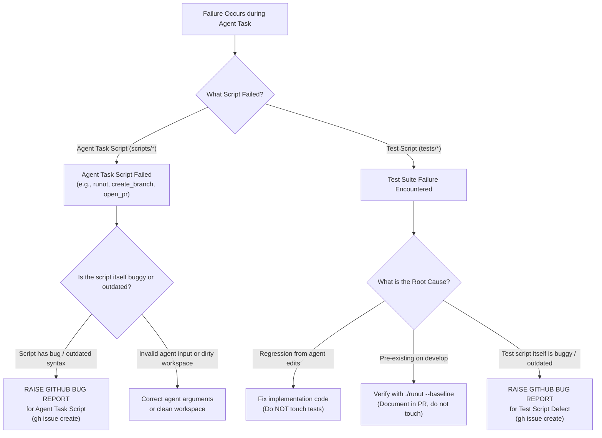

# Master Failure & Script Defect Guideline (Agent Tasks & Tests)

This document defines the repository's mandatory protocol for handling failures in **Agent Task Scripts (`scripts/`)** and **Test Verification Scripts (`tests/`)**.

---

## 🚦 When to Apply & What to Expect

- **When to Apply:** Any time an agent encounters a failure while running an **Agent Task Script** (e.g. `./runut`, `./create_branch`, `./open_pr`, `./merge_pr`, `./sync_develop`) or running **Test Scripts** (`tests/test_*.py`).
- **What to Expect:**
  - Strict enforcement: unit tests are run **only when executable code is touched**.
  - Systematic root-cause triage: verify whether the failure is in the code under edit, or if the **script itself contains a bug or is outdated**.
  - Script Defect Policy: **Raise a formal GitHub bug report** whenever a script needs modification. Agents are strictly forbidden from silently hacking scripts or falling back to unvetted manual workarounds.

---

## 🛑 Strict Unit Test Execution Gate

1. **Executable Code Only:**
   - AI agents MUST run unit tests (`./runut`) **ONLY** when executable code has been modified (e.g. `.py` files, runtime configurations).
2. **Never for Instructions or Markdown:**
   - If a change touches **only** Markdown files (`.md`), guidelines (`guidelines/`), prompts text (`prompts/*.txt`), or documentation, agents are **strictly prohibited** from running `./runut`.
   - Running tests on doc-only changes wastes tokens, slows down execution, and risks blocking valid documentation PRs with unrelated baseline test failures.

---

## 🔍 Master Triage: Why Did the Script Fail?

Failures during agent workflows fall into two distinct domains: **Agent Task Scripts** and **Test Verification Scripts**.



---

## 🛠️ Domain 1: Failures in Agent Task Scripts (`scripts/`)

Agent Task Scripts (such as [`scripts/create_branch.sh`](file:///Users/abhiraj/Documents/news/agent/scripts/create_branch.sh), [`scripts/open_pr.sh`](file:///Users/abhiraj/Documents/news/agent/scripts/open_pr.sh), [`scripts/merge_pr.sh`](file:///Users/abhiraj/Documents/news/agent/scripts/merge_pr.sh), [`scripts/sync_develop.sh`](file:///Users/abhiraj/Documents/news/agent/scripts/sync_develop.sh), [`scripts/runut`](file:///Users/abhiraj/Documents/news/agent/scripts/runut), `bump_version.sh`, etc.) are designed to automate common tasks reliably.

### If an Agent Task Script Fails:
1. **Verify if the script contains a bug or is outdated:**
   - Has a CLI tool (e.g. `git`, `gh`, `pytest`) updated its behavior or output format?
   - Does the script have a parsing bug, flawed regular expression, or unhandled edge case?
   - Is an assumption in the script obsolete?
2. **Action Required — Raise a Bug Report:**
   - If the script needs to be changed due to a bug or outdated logic, **agents MUST raise a GitHub bug report** documenting the defect:
     ```bash
     gh issue create \
       --title "bug(script): <script_name> is defective or outdated" \
       --body "## Agent Task Script Defect Report
     ### Failing Script
     - Script: \`scripts/<script_name>\`
     - Command Executed: \`<exact command>\`
     - Exit Code / Error: \`<error message or traceback>\`

     ### Root Cause Analysis
     <Explain why the agent task script is failing, buggy, or outdated>

     ### Required Correction
     <Explain what modification the script requires to function correctly>" \
       --label "bug"
     ```
3. **Do Not Bypass Silently:** Never silently revert to ad-hoc, untracked shell plumbing without documenting the script failure.

---

## 🧪 Domain 2: Failures in Test Scripts (`tests/`)

When running unit tests (`./runut`), failures must be triaged as follows:

### 1. Regression from Agent Changes
- **Symptom:** A test was passing on `origin/develop`, but fails on the current branch after code edits.
- **Action:** Fix your implementation code. **Do not modify the test to fit broken code.**

### 2. Baseline / Pre-existing Failure
- **Symptom:** The failure occurs on pristine `origin/develop` independently of current changes (e.g. rate limit, third-party network, or known baseline gap).
- **Verification:** Run `./runut --baseline tests/test_<target>.py` to compare against a pristine develop worktree.
- **Action:** Do not attempt out-of-scope fixes. Note the pre-existing failure in the PR summary.

### 3. Test Script Defect / Outdated Test
- **Symptom:** The application code is correct and adheres to specifications, but the test script itself has:
  - An outdated assertion or assumption.
  - A broken mock or invalid test fixture.
  - A regression in the testing framework.
- **STRICT PROHIBITION:** Agents are **STRICTLY FORBIDDEN** from modifying, deleting, or weakening test scripts to make a test pass.
- **MANDATORY ACTION:** The agent **MUST raise a GitHub bug report** documenting the script defect:
  ```bash
  gh issue create \
    --title "bug(test): <test_name> script defect in tests/<test_file>.py" \
    --body "## Test Script Failure Report
  ### Failing Test
  - File: \`tests/<test_file>.py\`
  - Function / Method: \`<test_function_name>\`

  ### Root Cause Analysis
  <Explain why the test script itself is defective or outdated>

  ### Why Implementation Code is Correct
  <Explain why the app/core code satisfies the actual contract>

  ### Required Script Modification
  <Detail the exact correction the test script needs>" \
    --label "bug"
  ```
- Reference the newly created issue number in your PR description.
