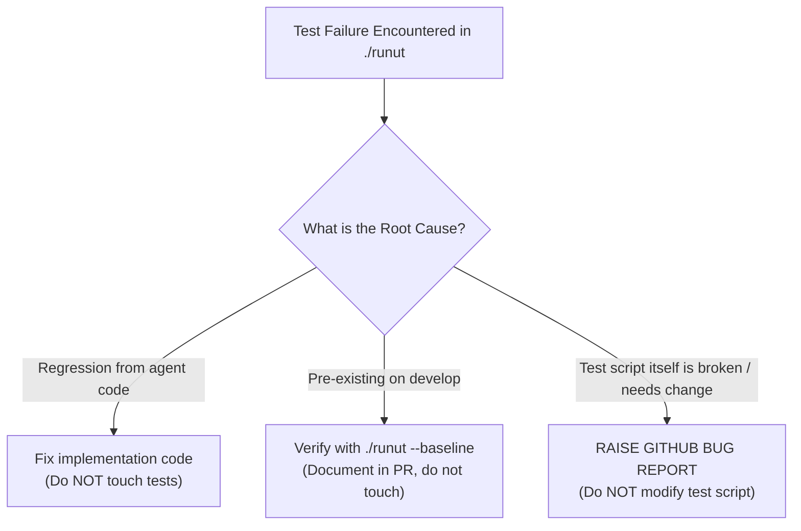

# Master Test Failure & Script Defect Guideline

This document defines the repository's mandatory protocol for running tests, diagnosing test failures, and handling defects in test scripts.

---

## 🚦 When to Apply & What to Expect

- **When to Apply:** Any time an agent runs tests, encounters test failures, or discovers that a test script itself may be broken or outdated.
- **What to Expect:**
  - Strict enforcement: unit tests are run **only when executable code is touched**.
  - Systematic root-cause verification for any failure.
  - Zero tolerance for silently weakening or mutating test scripts: **raise a GitHub bug report** if a test script requires modification.

---

## 🛑 Strict Unit Test Execution Gate

1. **Executable Code Only:**
   - AI agents MUST run unit tests (`./runut`) **ONLY** when executable code has been modified (e.g. `.py` files, runtime configurations).
2. **Never for Instructions or Markdown:**
   - If a change touches **only** Markdown files (`.md`), guidelines (`guidelines/`), prompts text (`prompts/*.txt`), or documentation, agents are **strictly prohibited** from running `./runut`.
   - Running tests on doc-only changes wastes tokens, slows down execution, and risks blocking valid documentation PRs with unrelated baseline test failures.

---

## 🔍 Master Failure Verification Protocol (Why Did It Fail?)

When a test failure occurs during code verification, the agent MUST pause and systematically verify the root cause across three categories:



### 1. Regression from Agent Changes
- **Symptom:** A test was passing on `origin/develop`, but fails on the current branch after code edits.
- **Action:** The agent must inspect its own implementation code and fix the defect. **Do not modify the test to fit broken code.**

### 2. Baseline / Pre-existing Failure
- **Symptom:** The failure occurs on pristine `origin/develop` independently of current changes (e.g. rate limit, third-party network, or known baseline gap).
- **Verification:** Run `./runut --baseline tests/test_<target>.py` to compare against a pristine develop worktree.
- **Action:** Do not attempt out-of-scope fixes. Note the pre-existing failure in the PR summary.

### 3. Test Script Defect ("Need to Change Script")
- **Symptom:** The implementation code is correct and adheres to specifications, but the test script itself has:
  - An outdated assertion or assumption.
  - A broken mock or invalid test fixture.
  - A regression in the testing framework.
- **STRICT PROHIBITION:** Agents are **STRICTLY FORBIDDEN** from modifying, deleting, or weakening test scripts to make a test pass.
- **MANDATORY ACTION:** The agent **MUST raise a GitHub bug report** documenting the script defect:
  ```bash
  gh issue create \
    --title "bug(test): <test_name> script defect in tests/<test_file>.py" \
    --body "## Test Script Failure Report
  ### Failing Test
  - File: \`tests/<test_file>.py\`
  - Function / Method: \`<test_function_name>\`

  ### Root Cause Analysis
  <Explain why the test script itself is defective or outdated>

  ### Why Implementation Code is Correct
  <Explain why the app/core code satisfies the actual contract>

  ### Required Script Modification
  <Detail the exact correction the test script needs>" \
    --label "bug"
  ```
- After raising the bug, reference the newly created issue number in your PR description.
