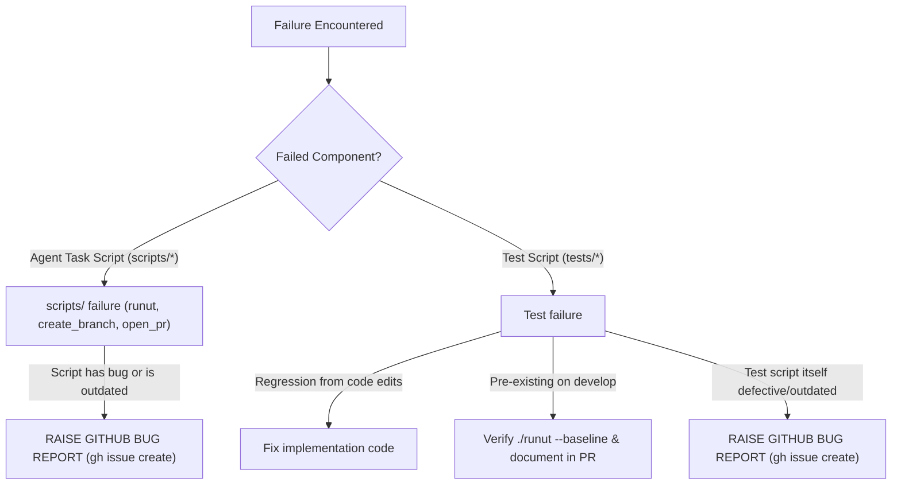

# Master Failure & Script Defect Guideline (Agent Tasks & Tests)

Protocol for handling failures in **Agent Task Scripts (`scripts/`)** and **Test Scripts (`tests/`)**.

---

## 🛑 Strict Unit Test Execution Gate

- **Run `./runut` ONLY when executable `.py` code is modified.**
- **Strictly SKIP `./runut`** when modifying only Markdown (`.md`), guidelines, prompts, or docs.

---

## 🔍 Master Triage Protocol



---

## 🛠️ Domain 1: Failures in Agent Task Scripts (`scripts/`)

Applies to: [`scripts/create_branch.sh`](file:///Users/abhiraj/Documents/news/agent/scripts/create_branch.sh), [`scripts/open_pr.sh`](file:///Users/abhiraj/Documents/news/agent/scripts/open_pr.sh), [`scripts/merge_pr.sh`](file:///Users/abhiraj/Documents/news/agent/scripts/merge_pr.sh), [`scripts/sync_develop.sh`](file:///Users/abhiraj/Documents/news/agent/scripts/sync_develop.sh), [`scripts/runut`](file:///Users/abhiraj/Documents/news/agent/scripts/runut), etc.

1. **Diagnose:** Check if the script failed due to an internal bug, regex defect, CLI change, or outdated assumption.
2. **Prohibition:** Do NOT silently bypass the script with ad-hoc manual plumbing.
3. **Action:** **Raise a GitHub bug report** documenting the defect:
   ```bash
   gh issue create --title "bug(script): <script_name> defect" --body "## Defect Details\n- Script: scripts/<script_name>\n- Error: <details>\n- Required Fix: <details>" --label "bug"
   ```

---

## 🧪 Domain 2: Failures in Test Scripts (`tests/`)

1. **Regression:** If your edits broke valid behavior $\rightarrow$ fix your implementation code.
2. **Baseline Failure:** If it fails on pristine develop (`./runut --baseline <target>`) $\rightarrow$ note in PR; do not attempt out-of-scope fixes.
3. **Test Script Defect:** If the test has an outdated assertion, broken mock, or invalid assumption:
   - **PROHIBITION:** Do NOT modify, delete, or weaken test scripts to force a pass.
   - **Action:** **Raise a GitHub bug report** documenting the test defect:
     ```bash
     gh issue create --title "bug(test): <test_name> defect in tests/<file>.py" --body "## Defect Details\n- File: tests/<file>.py\n- Why Code is Correct: <details>\n- Test Defect: <details>" --label "bug"
     ```
