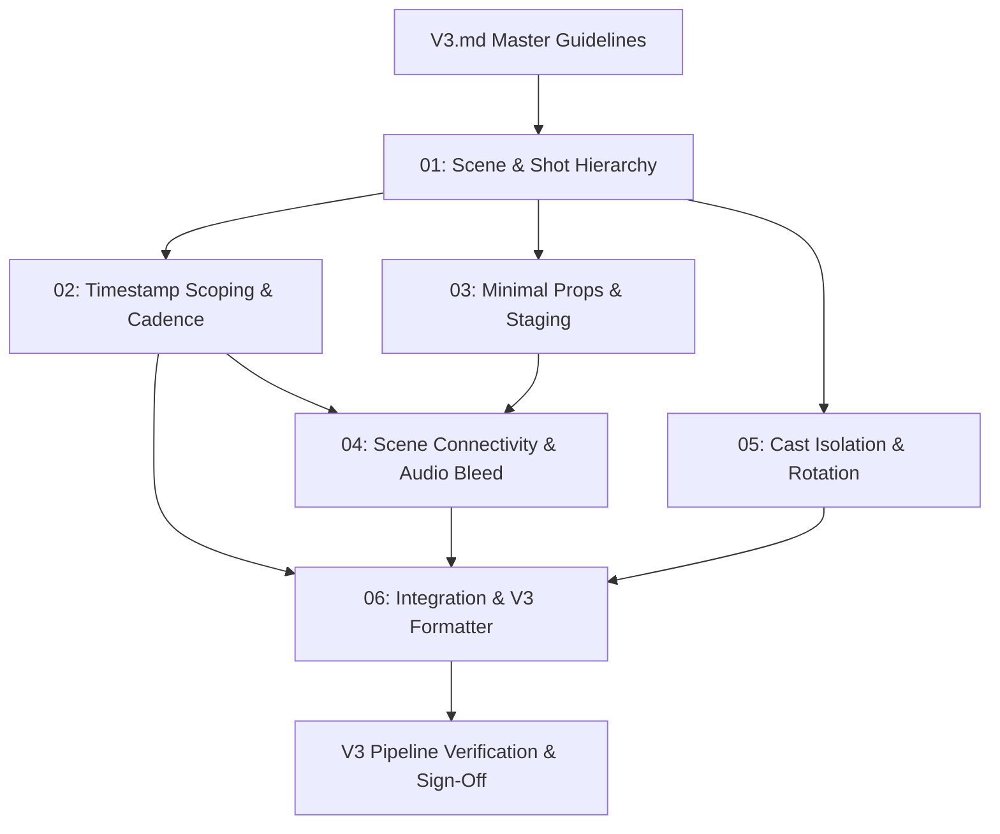

# V3 Master Implementation Plan & Sub-Feature Roadmap

> **Specification Source:** [`V3.md`](file:///Users/abhiraj/Documents/news/agent/v3/V3.md)  
> **Exploration & Gap Analysis:** [`V3_EXPLORATION.md`](file:///Users/abhiraj/Documents/news/agent/v3/V3_EXPLORATION.md)  
> **Critical Requirements Audit:** [**`AUDIT.md`**](file:///Users/abhiraj/Documents/news/agent/v3/AUDIT.md) *(Nonsense vs Feasible vs Issues)*  
> **Target Architecture:** Multi-Agent Editorial Pipeline (9:16 Vertical Reel Studio)

---

## 📌 Executive Overview & Architectural Decision

To reliably transition the Reel Studio pipeline to the **V3 Master Scriptwriting Guidelines**, the pipeline makes a **clean break directly to V3**:
- **Zero Backward Compatibility Baggage:** No dual-model wrappers, legacy prompt branches, or obsolete fallback paths.
- **Maximum Velocity:** Eliminates compatibility shims and directly upgrades models, formatters, and prompts to the V3 standard.
- **Sequential Execution:** Broken down into **6 modular sub-features**, each with an explicit `REQUIREMENTS.md` detailing functional requirements, schema, validators, and automated tests.

---

## 🗂 Sub-Feature Execution Sequence

> 📌 **Detailed Matrix:** See [**`SUB_FEATURES.md`**](file:///Users/abhiraj/Documents/news/agent/v3/SUB_FEATURES.md) for full status, difficulty ratings, architectural side effects, and mitigation strategies for each sub-feature.

| # | Sub-Feature Folder | Primary Focus | Depends On | Execution Readiness |
|---|---|---|---|---|
| **01** | [`01_scene_and_shot_hierarchy/`](file:///Users/abhiraj/Documents/news/agent/v3/01_scene_and_shot_hierarchy/REQUIREMENTS.md) | Dynamic scene count, 10s scene cap, Scene $\to$ Shot data models, `### SCENE X: [X Seconds]`, `#### Shot X` | None *(Foundation)* | 🟢 **Ready to Execute** |
| **02** | [`02_timestamp_scoping_and_cadence/`](file:///Users/abhiraj/Documents/news/agent/v3/02_timestamp_scoping_and_cadence/REQUIREMENTS.md) | Per-scene `[0:00]` time resets, line-level `[0:XX–0:XX]` timestamps, speed cadence cues `[... ~X.X wps]` | Sub-Feature 01 | 🟡 Blocked by 01 |
| **03** | [`03_minimal_props_and_visual_generation/`](file:///Users/abhiraj/Documents/news/agent/v3/03_minimal_props_and_visual_generation/REQUIREMENTS.md) | Stationary minimal props, emotion/gesture kinematics, refactoring `screenplay_coherence` away from active prop manipulation | Sub-Feature 01 | 🟡 Blocked by 01 |
| **04** | [`04_scene_connectivity_and_audio_bleed/`](file:///Users/abhiraj/Documents/news/agent/v3/04_scene_connectivity_and_audio_bleed/REQUIREMENTS.md) | Cross-scene direct consequence, visual anchors across cuts, 1–2s trailing audio bleed, conversational carryover | Sub-Features 01, 02, 03 | 🟡 Blocked by 01, 02, 03 |
| **05** | [`05_cast_isolation_and_rotation/`](file:///Users/abhiraj/Documents/news/agent/v3/05_cast_isolation_and_rotation/REQUIREMENTS.md) | Cast isolation across cuts ($\text{Cast}(N) \cap \text{Cast}(N+1) = \emptyset$), ensemble character generation, rotational stage casting | Sub-Feature 01 | 🟡 Blocked by 01 |
| **06** | [`06_integration_and_v3_formatter/`](file:///Users/abhiraj/Documents/news/agent/v3/06_integration_and_v3_formatter/REQUIREMENTS.md) | Canonical V3 Screenplay Formatter, end-to-end Chief Editor orchestration, deterministic V3 validation gate, UI integration | Sub-Features 01 – 05 | 🟡 Blocked by 01–05 |

---

## 🔄 Execution & Dependency Graph

---

## 📋 Sub-Feature Details

### 1. [`01_scene_and_shot_hierarchy`](file:///Users/abhiraj/Documents/news/agent/v3/01_scene_and_shot_hierarchy/REQUIREMENTS.md)
* Dynamic scene derivation based on narrative complexity rather than fixed 5-second buckets.
* Strict 10-second ceiling on individual scene durations.
* Hierarchical `Scene` $\to$ `Shot` schema in [`core/models.py`](file:///Users/abhiraj/Documents/news/agent/core/models.py).
* Headings: `### SCENE X: Title [X Seconds]` and un-timestamped `#### Shot X`.

### 2. [`02_timestamp_scoping_and_cadence`](file:///Users/abhiraj/Documents/news/agent/v3/02_timestamp_scoping_and_cadence/REQUIREMENTS.md)
* Timestamps reset to `[0:00]` at the start of every scene.
* Explicit start-to-end timestamps `[0:XX – 0:XX]` attached directly to every spoken dialogue line and SFX cue.
* Performance and speed cadence cues attached to dialogue lines: `[Frantic delivery ~2.8 wps]`.

### 3. [`03_minimal_props_and_visual_generation`](file:///Users/abhiraj/Documents/news/agent/v3/03_minimal_props_and_visual_generation/REQUIREMENTS.md)
* Deprecate active prop manipulation (clinking chai, unfolding paper, holding phones) in favor of stationary environmental props.
* Prioritize expressive facial reactions, physical stance, and exaggerated gestures to ensure artifact-free generative video output (Veo / Sora).

### 4. [`04_scene_connectivity_and_audio_bleed`](file:///Users/abhiraj/Documents/news/agent/v3/04_scene_connectivity_and_audio_bleed/REQUIREMENTS.md)
* Direct consequence: Subsequent scenes immediately react to previous scene outcomes.
* Visual anchors: Primary subjects or focal points remain visible across cut boundaries.
* Audio bleed: Trailing SFX carry over 1–2 seconds into the next scene.
* Conversational carryover: Opening lines directly reference the previous event.

### 5. [`05_cast_isolation_and_rotation`](file:///Users/abhiraj/Documents/news/agent/v3/05_cast_isolation_and_rotation/REQUIREMENTS.md)
* Cast isolation rule: Characters in Scene $N$ must not appear in Scene $N+1$.
* Stage 2 ensemble generation producing distinct character pairs/groups.
* Stage 3 alternating dialogue assignment ensuring clean cast rotation across cuts.

### 6. [`06_integration_and_v3_formatter`](file:///Users/abhiraj/Documents/news/agent/v3/06_integration_and_v3_formatter/REQUIREMENTS.md)
* Complete V3 Screenplay markdown output generation.
* Integration into the Chief Editor orchestrator and Streamlit Studio interface.
* Unified deterministic validation gate and automated regression test suite.
